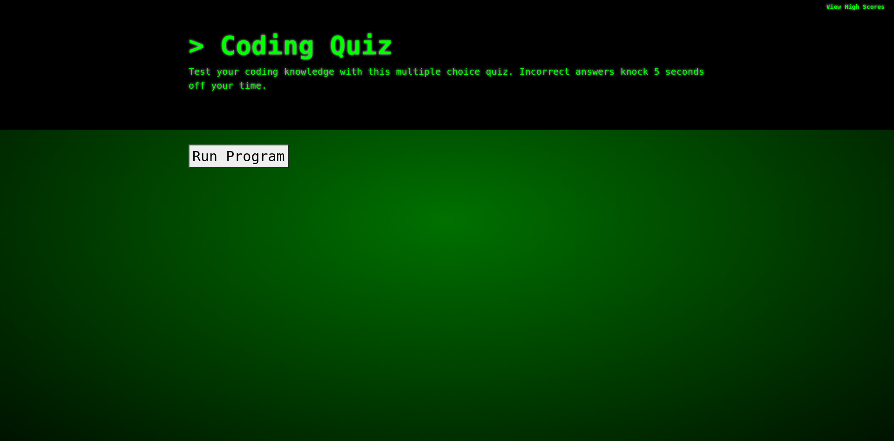
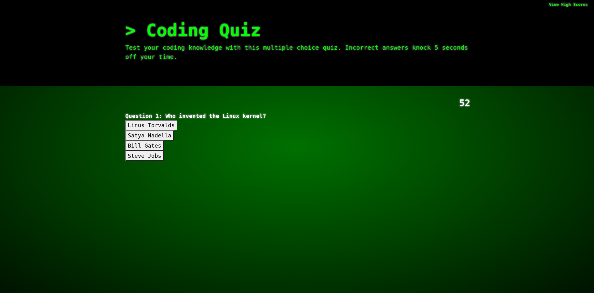
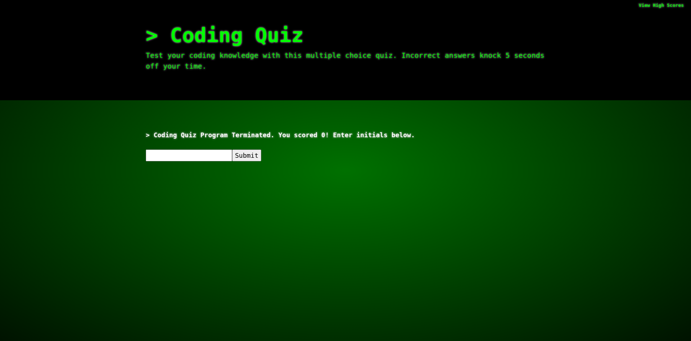
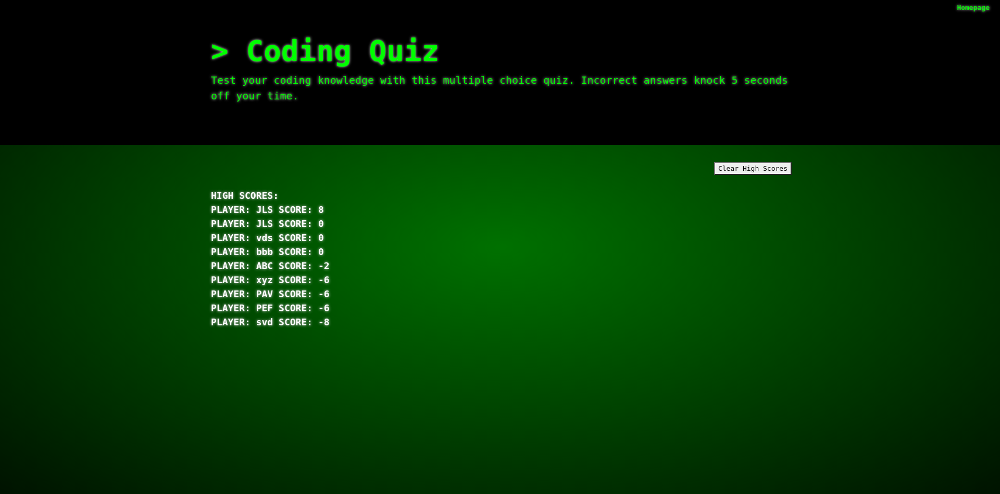

# coding-quiz
A coding quiz program that runs in the browser. 

This project is a coding quiz that runs in the browser.

[Project Links]

Deployed application: https://balokdecoy.github.io/coding-quiz/

Github repo: https://github.com/balokdecoy/coding-quiz

[Project Screenshots]

[User Instructions and Program Logic]

Project is an 8 question quiz. 

Highest score: 8 points. Lowest score: 0 points.

Time to complete the quiz is 60 seconds. 

Incorrect answers deduct 5 seconds from user's time.

User is presented with the start screen. 

Clicking "Run Program" starts the quiz. 

On start, a countdown timer displays. 

User answers each question in turn by clicking on their desired answer button. 

If user answers all questions before time runs out, they are sent to the high score submission screen. User is informed of their score. After entering initials, user is sent to the High Scores page. 

If time runs out before user completes the quiz, the user is sent to the high score submission screen, informed of their score, and asked to enter their initials. 

Each time user plays, their username and score is stored in local storage as an object in an array. 

At any time before or during the quiz, the user can click "View High Scores" at top right to view the high scores page. 

At the High Scores page, the View High Scores link is replaced by a Homepage link which sends the user back to the start screen. 

The High Score page renders all high scores in local storage and adds the current game's username and score. 

The High Scores page contains a Clear High Scores button. On clicking this button, the high scores on the screen are erased, and the scores stored in local storage are cleared. 

[Acknowledgments]

The teriminal-like visual style of the body section of the program is adapted from a CSS terminal tutorial by Chris Coyier writing for css-tricks.com. The tutorial can be found at this URL: 
https://css-tricks.com/old-timey-terminal-styling/

Chris Coyier's website: https://chriscoyier.net/ 

The function attrs(element, attributes) at line 195 was borrowed from a response on StackOverflow by user "Ariel". This function sets attributes to elements dynamically. 

The StackOverflow page where this function is provided can be reached at: https://stackoverflow.com/questions/12274748/setting-multiple-attributes-for-an-element-at-once-with-javascript 

Thanks to John Herman, GWU tutor, for his assistance with organizing my functions logically and breaking functions out discretely. His feedback was invaluable. 

Thanks to Amir Ashtiany, Young Ji Kim, Beatrice Ellingson, Frankie Rosado, and Rachel Wanke for their feedback, support, and brainstorming. Visit their Github pages here:

Amir Ashtiany - https://github.com/Alexfit4
Young Ji Kim - https://github.com/youjmi
Beatrice Ellingson - https://github.com/beatricellingson
Frankie Rosado - https://github.com/Franciscorosado09
Rachel Wanke: - https://github.com/rwanke14 